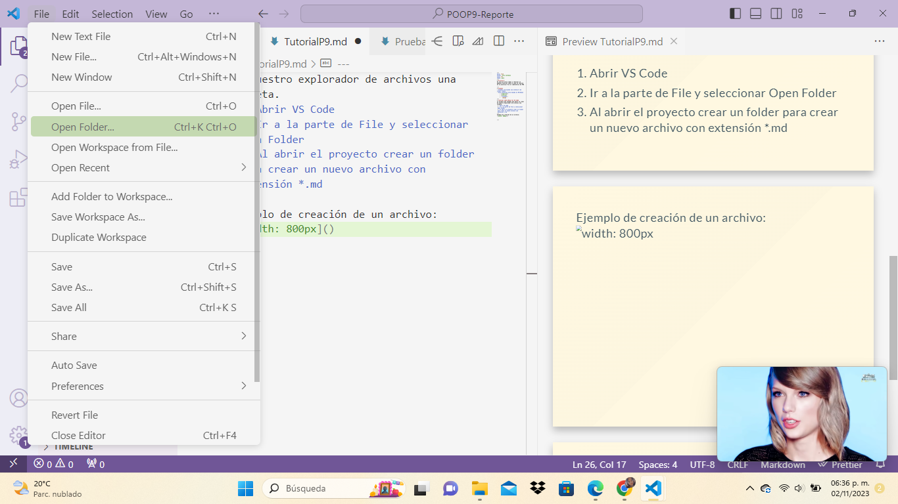
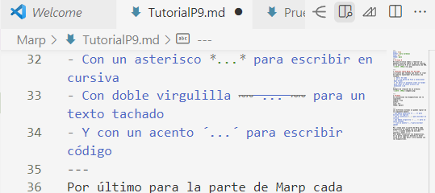
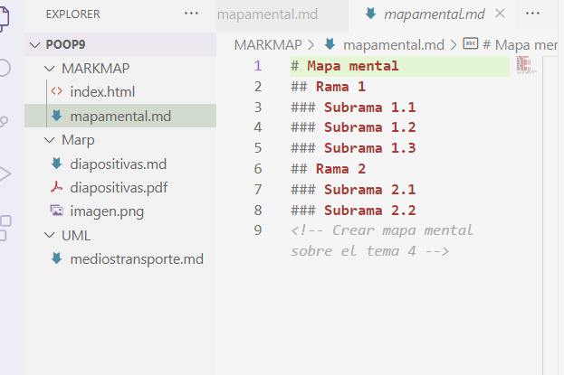
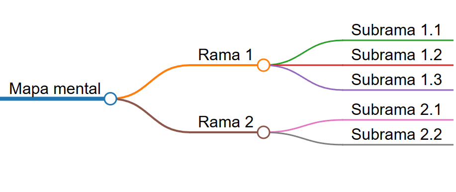
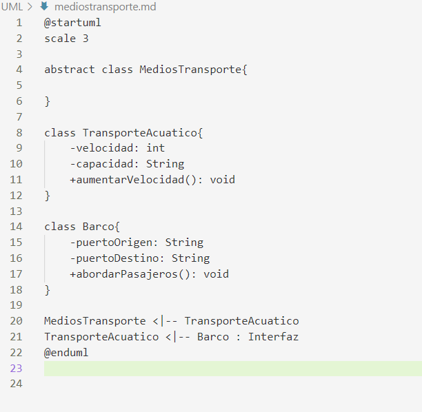
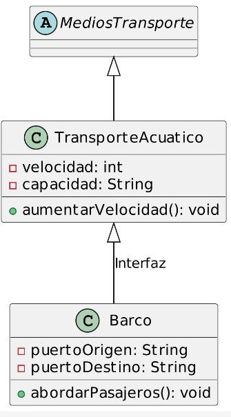

# Prática 9
En esta práctica vamos a realizar un pequeño tutorial sobre lo que se realizó en la practica 9 en el laboratorio de POO con la ayuda de Visual Studio Code.

---
# Tutorial sobre Marp for VS Code
Lo primero que tenemos que hecer es crear en nuestro explorador de archivos una carpeta.
 1. Abrir VS Code
 2. Ir a la parte de File y seleccionar Open Folder
 3. Al abrir el proyecto crear un folder para crear un nuevo archivo con extensión *.md
---
Ejemplo de creación de un archivo:

---
# Formato
Se recomienda inicializar las diapositivas con lo siguiente:
**marp: true
author: 
size: 4:3
theme: gaia**

---
Los diferenes estidos se pueden lograr de la siguiente manera:
- Con doble asterisco ** ... ** para escribir en negrita
- Con un asterisco *...* para escribir en cursiva
- Con doble virgulilla ~~ ... ~~ para un texto tachado
- Y con un acento ´...´ para escribir código
---
Por último para la parte de Marp cada diapositiva se separa con tres guiones (---), y cuando acabes de escribir vuelves a poner (---).
Para poder visualizar las diapositivas, en la parte superior derecha al hacer click en el logo abrirá otra ventana con las diapositivas.

---
# Tutorial sobre Markmap
Markmap es una extensión de Visual Studio Code que no ayuda a crear mapas mentales.
Es muy sencillo tanto de usar como de entender.

Cada rama inicializa con # y dependiendo de cuantas subramas se necesitan se van aumentando el número de #.

Por ejemplo la primera rama sería con un # y si la rama contiene dos subtemas, a cada subtema quedaría como ## Subtema 1,2.

---
### Ejemplo de sintaxis de Markmap
Para que aparezca nuestro mapa hay que hacer click en el ícono de la extension de Markmap

---
### Ejemplo del mapa mental

---
Para poder exportar nuestro mapa a un archivo html, en la parte inferior derecha de donde aparece nuestro mapa aparece exportar y al gurdarlo necesitamos nombrarlo index.html

---
# Tutorial sobre PlantUML Previewer
Es una extensión de Visual Studio Code que no ayuda a crear nuestros diagramas de clases de una manera más rápida ya que sólo hay que escribir nuestras clases ya programadas y ocupar la extensión.
Comienza con un @startuml y finaliza con con @enduml

---
Igual necesitamos irnos al proyecto, crear una nueva carpeta y crear un nuevo archivo.
Después hay que poner el código de nuestras clases junto con sus atributos y métodos.

---
Para poder ejecutarlo debemos de ir a la pestaña de view/command Palette/al aparecer la barra de búsqueda escribir  Preview current PlantUML Code.

Al hacer click aparecerá una nueva ventana con nuestro diagrama de clses con los atributos y métodos de nuestras clases.

---
Ejemplo de ejecución de PlantUML Previewer

